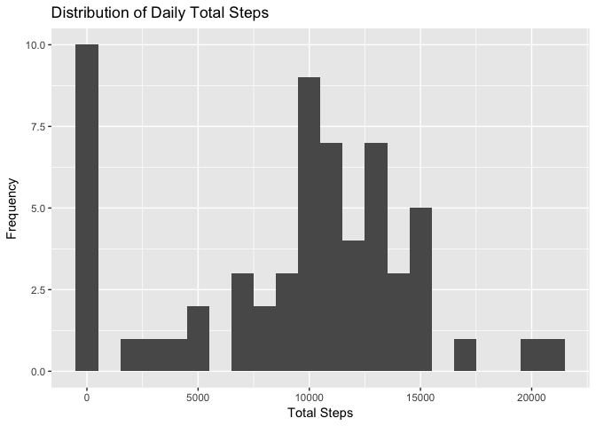
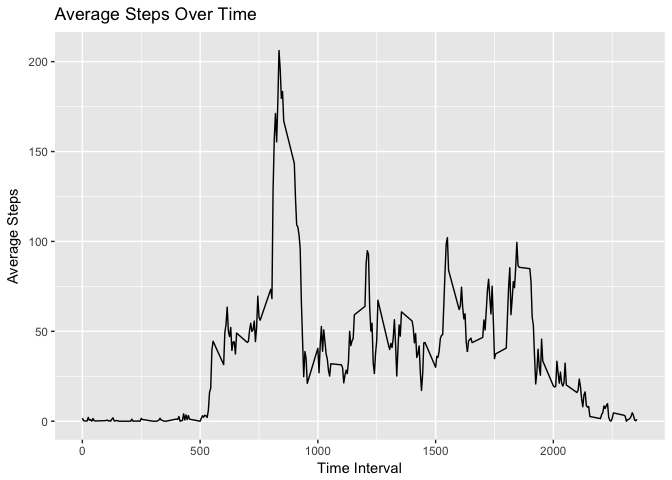
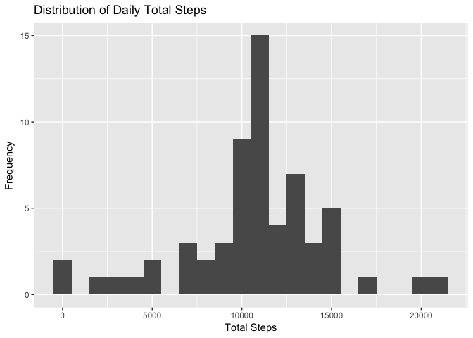
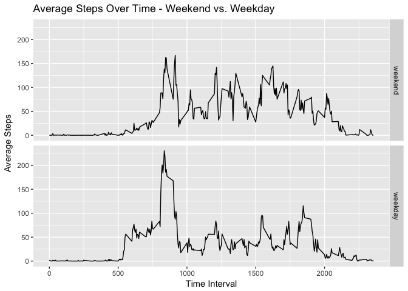

# Reproducible Research: Peer Assessment 1
Connor Gooding  
8/24/2017  


```r
library(dplyr)
library(ggplot2)
library(tibble)
```

## Loading and preprocessing the data

```r
unzip('activity.zip')
activity <- read.csv('activity.csv', colClasses = c('integer', 'Date', 'integer'))
```

## What is mean total number of steps taken per day?

The histogram below illustrates the distribution of total steps taken each day.

```r
activity_by_day <- activity %>% group_by(date) %>% 
                    summarize(totalSteps = sum(steps, na.rm = T)) %>%
                    as.data.frame()
ggplot(data = activity_by_day, aes(x = totalSteps)) + 
    geom_histogram(binwidth = 1000) +
    xlab('Total Steps') + ylab('Frequency') +
    ggtitle('Distribution of Daily Total Steps')
```

<!-- -->

The median and mean total steps taken per day are reported below.

```r
summ1 <- summary(activity_by_day$totalSteps, na.rm = T)[3:4]
summ1
```

```
##   Median     Mean 
## 10395.00  9354.23
```

## What is the average daily activity pattern?

The following time series plot illustrates the average daily activity pattern.

```r
activity_by_interval <- activity %>% group_by(interval) %>% 
                    summarize(avgSteps = mean(steps, na.rm = T)) %>%
                    as.data.frame()

ggplot(data = activity_by_interval, aes(x = interval, y = avgSteps)) + 
    geom_line() + xlab('Time Interval') + ylab('Average Steps') + 
    ggtitle('Average Steps Over Time')
```

<!-- -->

On average, the maximum number of steps occurred at the 5-minute interval starting 835 minutes into the trial.


```r
max_step <- which( activity_by_interval$avgSteps == max(activity_by_interval$avgSteps) )
activity_by_interval[max_step,1:2]
```

```
##     interval avgSteps
## 104      835 206.1698
```

## Imputing missing values

There are 2304 missing values in the activity dataset. 


```r
sum(is.na(activity))
```

```
## [1] 2304
```

To impute these missing values, the average value of steps taken at the interval, averaged across all days, will be used as the values for steps.


```r
activity_full <- activity
indicesNA <- which(is.na(activity$steps))
activity_full[indicesNA, "steps"] <- inner_join(activity, activity_by_interval, 
                                               by = "interval")[indicesNA, "avgSteps"]
activity_full <- select(activity_full, 1:3)
sum(is.na(activity_full))
```

```
## [1] 0
```

The histogram below illustrates the distribution of total steps taken each day with missing values imputed using the aforementioned strategy. 


```r
activity_by_day2 <- activity_full %>% group_by(date) %>% 
                    summarize(totalSteps = sum(steps, na.rm = T)) %>%
                    as.data.frame()
ggplot(data = activity_by_day2, aes(x = totalSteps)) + 
    geom_histogram(binwidth = 1000) +
    xlab('Total Steps') + ylab('Frequency') +
    ggtitle('Distribution of Daily Total Steps')
```

<!-- -->

The median and mean total steps taken per day from the imputed data are reported below. 


```r
summ2 <- summary(activity_by_day2$totalSteps, na.rm = T)[3:4]
summ2
```

```
##   Median     Mean 
## 10766.19 10766.19
```

After imputation, the median total steps taken per day increases by about 371 steps, while the mean total steps taken per day increase by about 1412 steps. This is because the imputed values add artificial steps to the daily totals.


```r
summ_diff <- summ2 - summ1
names(summ_diff) <- c("Change in Median", "Change in Mean")
summ_diff
```

```
## Change in Median   Change in Mean 
##         371.1887        1411.9592
```

## Are there differences in activity patterns between weekdays and weekends?

A new factor must be added to the data to classify each observation as a weekend or weekday observation.


```r
activity_full$dateType <- factor(as.POSIXlt(activity_full$date)$wday %in% 1:5, 
                                 labels = c("weekend", "weekday"))
```

The following time series plots activity patterns averaged across all weekends and weekdays.


```r
activity_by_interval2 <- activity_full %>% group_by(dateType, interval) %>% 
                    summarize(avgSteps = mean(steps, na.rm = T)) %>%
                    as.data.frame()

ggplot(data = activity_by_interval2, aes(x = interval, y = avgSteps)) + 
    facet_grid( dateType~. ) +
    geom_line()  + xlab('Time Interval') + ylab('Average Steps') + 
    ggtitle('Average Steps Over Time - Weekend vs. Weekday')
```

<!-- -->

